# FluidNet

**Interactive real-time 2D fluid simulation powered only by neural networks**

<!--

  

-->

https://github.com/user-attachments/assets/c32d6b8d-7b06-45a5-b370-abdd00fa81d5

## Overview

FluidNet is an interactive real-time fluid simulation system that aims to combine the visual quality of an interactive physics-based fluid solvers with the speed of neural network inference (not there yet). A convolutional neural network (UNet) is trained on Blender Mantaflow simulations, then deployed in a C++ engine for autoregressive rollout in a real-time execution.

>**Note:** The entire pipeline currently operates at 128×128 resolution. This project was developed on a single consumer-grade machine - while the code supports higher resolutions (256×256+), generating training data and training at higher resolutions requires significant compute time. A higher-resolution pipeline is planned for future work when resources permit.

**Key Features:**
- Neural network trained on generated Blender/Mantaflow simulations
- Real-time inference using ONNX Runtime (CPU or GPU)
- Interactive controls: inject density via emitter-mask, apply forces, add obstacles via collider-mask

## The Pipeline

End-to-end pipeline to transform 3D physics simulations into a real-time multi-frames 2D neural dataset used for training:

```mermaid
graph LR
    A[Blender Simulation] --> B[VDB/Alembic Export]
    B --> C[NPZ Conversion]
    C --> D[CNN Training]
    D --> E[ONNX Export]
    E --> F[C++ Engine]

    style A fill:#4FC3F7,stroke:#01579B,stroke-width:2px,color:#000
    style B fill:#FFB74D,stroke:#E65100,stroke-width:2px,color:#000
    style C fill:#F06292,stroke:#880E4F,stroke-width:2px,color:#000
    style D fill:#66BB6A,stroke:#1B5E20,stroke-width:2px,color:#000
    style E fill:#BA68C8,stroke:#4A148C,stroke-width:2px,color:#000
    style F fill:#FF7043,stroke:#BF360C,stroke-width:2px,color:#000
```

**Blender Simulation** → Automated generation of randomized fluid scenarios using Mantaflow solver ([vdb-tools/README.md](vdb-tools/README.md))

**VDB/Alembic Export** → 3D volumetric cache files and mesh metadata

**NPZ Conversion** → Transform 3D simulations to 2D training data with normalization

**CNN Training** → UNet learns fluid dynamics ([ml/README.md](ml/README.md))

**ONNX Export** → Optimized model format for C++ inference

**C++ Engine** → Real-time interactive execution ([engine/README.md](engine/README.md))

## Simulation Creation And Export

Training data is generated through an automated pipeline:

**1. Blender Simulation Generation**
Headless Blender scripts create randomized fluid scenarios using Mantaflow, producing 3D volumetric data (VDB format) and mesh animations (Alembic format).

**2. 3D to 2D Projection (vdb-tools)**
Custom pipeline converts 3D simulations into 2D training data by projecting volumetric fields onto a plane and extracting relevant physics quantities (density, velocity, emitter/collider masks).

**3. NPZ Dataset**
Processed sequences are saved as compressed NPZ files, ready for PyTorch training. Each sample contains the current state, previous state, and boundary conditions to predict the next frame.

#### Here you can see the projection result from Blender simulation to .npz converted to .png:

  
  &nbsp;&nbsp;&nbsp;
  

  
  &nbsp;&nbsp;&nbsp;
  

  
  &nbsp;&nbsp;&nbsp;
  

## Training & Model Architecture

### Model
A UNet-based encoder-decoder architecture with skip connections. Extensive experimentation with different configurations including depth, base channels, normalization layers, and activation functions.

**Input/Output:**
- **Input**: 6 channels (density_t, velx_t, velz_t, density_t-1, emitter_t, collider_t)
- **Output**: 3 channels (density_t+1, velx_t+1, velz_t+1)

### Loss Functions
Training involved experimentation with multiple loss components:
- **MSE Loss** - Standard reconstruction loss
- **Divergence Penalty** - Enforces fluid incompressibility
- **Emitter Loss** - Prevents density generation in non-emitter regions, avoid hallucinations
- **Gradient Loss** - Preserves sharp density features

Different combinations and weightings were tested to balance visual quality and physical realism.

### Validation
While physics-based metrics (divergence, kinetic energy, collider violations) were tracked during training, most validation came from exporting models and qualitatively evaluating autoregressive rollout behavior to "feel" the fluid dynamics.

For complete training details, see [ml/README.md](ml/README.md).

### Progressive Training (Curriculum Learning)

Models are trained using a staged approach where each K-step model initializes from the previous:

**K1 (1-step)** → **K2 (2-step)** → **K3 (3-step)** → **K4 (4-step)**

Each stage learns to predict further into the future, building on the physics knowledge from the previous stage. This curriculum approach is critical for autoregressive stability - without it, models drift and collapse after a few dozen frames. With K-training, stable rollouts last 600+ frames.

## Real-Time Engine

The C++ engine provides an interactive environment for experiencing trained fluid models:

**Technology Stack:**
- **ONNX Runtime**: ML inference with CPU/CUDA execution providers
- **OpenGL**: Rendering
- **GLFW**: Cross-platform windowing and input
- **ImGui**: Real-time UI and debugging interface

**Interactive Controls:**
- Velocity mode + drag: Inject velocity forces
- Configurable brush radius, force strength, and emission rate
- Pause, reset, and model switching

For build instructions and usage details, see [engine/README.md](engine/README.md).

## Visual Examples

https://github.com/user-attachments/assets/87e762a8-4c94-427e-b96a-97e7c52206fe

https://github.com/user-attachments/assets/50606547-ee24-4d28-b777-5358a2aca9f0

https://github.com/user-attachments/assets/87162cd3-845f-4095-91c6-33c636dd9928

https://github.com/user-attachments/assets/63ff29ba-4b83-41d7-ab16-8c9676a027f5

https://github.com/user-attachments/assets/85eb3ff2-0c59-47c8-919a-bbbe1fd3fdac

## Getting Started

**Note:** This project is not yet packaged for easy public use. Pre-trained weights will be made available on HuggingFace in the future. However, if you're handy with build systems, everything should work - the engine can be built and trained models exported following the instructions in [engine/README.md](engine/README.md) and [ml/README.md](ml/README.md).

## Performance Notes

Different UNet architectures were tested with varying inference speeds (GPU metrics on RTX 3070):

**Medium UNet (GPU):** ~5ms inference - good balance of quality and speed, handles colliders well

**Small UNet (GPU):** ~1-2ms inference - very fast, but collider behavior isn't quite solved yet (work in progress)

**Small UNet quantized (INT8 CPU):** ~30-35ms inference - on-the-fly quantization without calibration, surprisingly usable and fluid on CPU without a GPU, though collider interactions still need "refinement"

A key advantage of this approach: inference time is constant regardless of scene complexity. Whether you have one emitter or ten colliders, performance stays the same - unlike traditional physics solvers that scale with complexity.

The goal is to get the smaller/faster models to match the physics quality of the medium architecture while maintaining speed gains.

## Technical References

**Used in this project:**

- **tempoGAN: A Temporally Coherent Generative Model** ([arXiv:1806.02071](https://arxiv.org/pdf/1806.02071))
  Referenced for physics-aware loss implementations (divergence and gradient losses).

- **Accelerating Eulerian Fluid Simulation with CNNs** ([ICML 2017](https://proceedings.mlr.press/v70/tompson17a/tompson17a.pdf))
  Foundational work on using CNNs for fluid simulation.

**For future exploration:**

- **Awesome Neural Physics** ([Project Page](https://hhuiwangg.github.io/projects/awesome-neural-physics/))
  Curated collection of papers and resources on physics-informed machine learning.

- **PhiFlow: Learning Physics** ([arXiv:2006.08762](https://arxiv.org/pdf/2006.08762))
  Differentiable physics framework for training neural simulators.

- **Transolver: A Fast Transformer Solver for PDEs** ([arXiv:2412.10748](https://arxiv.org/pdf/2412.10748))
  Recent work on learned PDE solvers using transformers.
