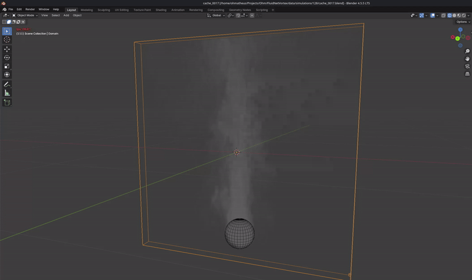
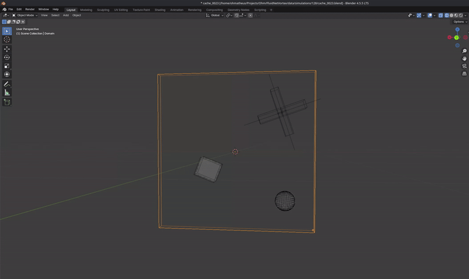
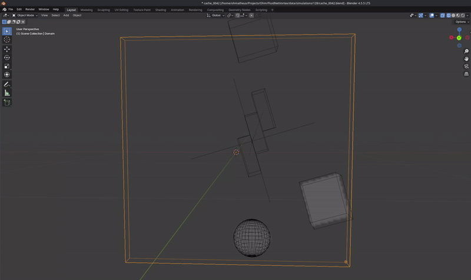

# FluidNet

**Interactive real-time 2D fluid simulation powered by neural networks**

<!--

  

-->

https://github.com/user-attachments/assets/c32d6b8d-7b06-45a5-b370-abdd00fa81d5

## Overview

FluidNet is an interactive real-time fluid simulation system that aims to combine the visual quality of an interactive physics-based fluid solvers with the speed of neural network inference (not there yet). A convolutional neural network (UNet) is trained on Blender Mantaflow simulations, then deployed in a C++ engine for autoregressive rollout in a real-time execution.

>Note:
>Everything is currenlty done in 128x128 (simulation cells). This all project is done on a simple computer. While it is theorically possible to make it in higher resolution (eg: 256x256) with the current code, simulation creation and training takes a lot of time. Will redo a pipe in 256x256 later, when time allow me to do so.

**Key Features:**
- Neural network trained on generated Blender/Mantaflow simulations
- Real-time inference using ONNX Runtime (CPU or GPU)
- Interactive controls: inject density via emitter-mask, apply forces, add obstacles via collider-mask

## The Pipeline

End-to-end pipeline to transform 3D physics simulations into a real-time multi-frames 2D neural dataset used for training:

```mermaid
graph LR
    A[Blender Simulation] --> B[VDB/Alembic Export]
    B --> C[NPZ Conversion]
    C --> D[CNN Training]
    D --> E[ONNX Export]
    E --> F[C++ Engine]

    style A fill:#4FC3F7,stroke:#01579B,stroke-width:2px,color:#000
    style B fill:#FFB74D,stroke:#E65100,stroke-width:2px,color:#000
    style C fill:#F06292,stroke:#880E4F,stroke-width:2px,color:#000
    style D fill:#66BB6A,stroke:#1B5E20,stroke-width:2px,color:#000
    style E fill:#BA68C8,stroke:#4A148C,stroke-width:2px,color:#000
    style F fill:#FF7043,stroke:#BF360C,stroke-width:2px,color:#000
```

**Blender Simulation** → Automated generation of randomized fluid scenarios using Mantaflow solver ([vdb-tools/README.md](vdb-tools/README.md))

**VDB/Alembic Export** → 3D volumetric cache files and mesh metadata

**NPZ Conversion** → Transform 3D simulations to 2D training data with normalization

**CNN Training** → UNet learns fluid dynamics ([ml/README.md](ml/README.md))

**ONNX Export** → Optimized model format for C++ inference

**C++ Engine** → Real-time interactive execution ([engine/README.md](engine/README.md))

## Simulation Creation And Export

  
  &nbsp;&nbsp;&nbsp;
  

  
  &nbsp;&nbsp;&nbsp;
  

  
  &nbsp;&nbsp;&nbsp;
  

## Training & Model Architecture

### UNet Architecture
The model uses a compact encoder-decoder architecture with skip connections:
- Instance normalization
- GELU activation
- Optimized for real-time performance but some choices has been made to keep a nice smoke behaviour.

### Loss Functions
Training uses multiple loss components to enforce physical realism:

**MSE Loss** - Standard reconstruction loss for accurate next-frame prediction.

**Divergence Penalty** - Enforces incompressibility constraint (∇·v ≈ 0) to prevent density spawning during rollout.

**Emitter Loss** - Prevents density generation in non-emitter regions. Only allows density where emitters exist or density is already present. (Does not compete with smoke advection)

**Gradient Loss** - Preserves sharp density features by matching spatial gradients between prediction and ground truth. (Create artifacts, compete with MSE)

### Validation Metrics
Physics-based metrics ensure the model respects fluid dynamics:
- **Divergence norm**: Measures incompressibility
- **Kinetic energy**: Monitors velocity stability over time
- **Collider violation**: Checks for density inside colliders
- **Emitter accuracy**: Validates emission rate correctness

For complete training details, see [ml/README.md](ml/README.md).

## Real-Time Engine

The C++ engine provides an interactive environment for experiencing trained fluid models:

**Technology Stack:**
- **ONNX Runtime**: ML inference with CPU/CUDA execution providers
- **OpenGL**: Hardware-accelerated rendering
- **GLFW**: Cross-platform windowing and input
- **ImGui**: Real-time UI and debugging interface

**Interactive Controls:**
- Left click + drag: Inject velocity forces
- Configurable brush radius, force strength, and emission rate
- Pause, reset, and model switching

For build instructions and usage details, see [engine/README.md](engine/README.md).

## Visual Examples

  
  

  

## Getting Started

### Quick Start
1. Build the engine: Follow instructions in [engine/README.md](engine/README.md)
2. Download a pre-trained ONNX model (or train your own)
3. Place the `.onnx` file in `data/onnx/`
4. Run: `./engine/build-release/fluid_engine`

## Technical References

This project builds on research in physics-informed neural networks and learned fluid simulation:

- **Transolver: A Fast Transformer Solver for PDEs** ([arXiv:2412.10748](https://arxiv.org/pdf/2412.10748))
  Recent work on learned PDE solvers using transformers.

- **Awesome Neural Physics** ([Project Page](https://hhuiwangg.github.io/projects/awesome-neural-physics/))
  Curated collection of papers and resources on physics-informed machine learning.

- **PhiFlow: Learning Physics** ([arXiv:2006.08762](https://arxiv.org/pdf/2006.08762))
  Differentiable physics framework for training neural simulators.

- **tempoGAN: A Temporally Coherent Generative Model** ([arXiv:1806.02071](https://arxiv.org/pdf/1806.02071))
  Temporal coherence in learned fluid simulation using adversarial training.

- **Accelerating Eulerian Fluid Simulation with CNNs** ([ICML 2017](https://proceedings.mlr.press/v70/tompson17a/tompson17a.pdf))
  Foundational work on using CNNs to accelerate fluid solvers.
