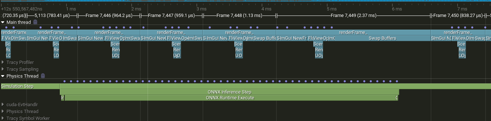

# Engine - Real-Time Fluid Simulation

Interactive C++ application that runs trained neural network models for real-time fluid simulation using ONNX Runtime.

## What It Does

The engine loads ONNX models and runs them autoregressively to simulate fluid dynamics in real-time. You can interact with the simulation through mouse controls - inject forces, add density, place colliders. Think of it as a fluid playground powered entirely by a neural network, no traditional physics solver involved.

**Includes:**
- Real-time inference with ONNX Runtime
- GPU acceleration via CUDA (recommended - though quantized models can run on CPU)
- Interactive controls for forces, emitters, and obstacles
- ImGui interface for live parameter tweaking
- Model hot-swapping without restart

## Performance

Inference speed varies by architecture (GPU metrics on RTX 3070):

**Medium UNet (GPU):** ~5ms - good balance of quality and speed, handles colliders well

**Small UNet (GPU):** ~1-2ms - very fast, but collider behavior isn't quite solved yet (ongoing work)

**Small UNet quantized (INT8 CPU):** ~30-35ms - on-the-fly quantization without calibration, surprisingly usable without a GPU, though collider physics still needs refinement

A key advantage: inference time is constant regardless of scene complexity. Whether you have one emitter or ten colliders, performance stays the same.

The engine uses double-buffering so rendering stays smooth at ~60 FPS even during inference.

Frame profiling via Tracy:

<p align="center">
  
</p>

## Building

**Requirements:**
- C++20 compiler (GCC 11+, Clang 14+, MSVC 2022+)
- CMake 3.20+
- ONNX Runtime 1.23.2 (must match the Python training environment)
- NVIDIA GPU with CUDA support (optional, but recommended)
  - CUDA Toolkit 12.x (tested with 12.8)
  - cuDNN 9.x

**Build steps:**

1. Install system dependencies (OpenGL, X11, etc. - standard graphics dev packages)

2. Download and extract ONNX Runtime 1.23.2 GPU build:
   ```bash
   cd engine/external
   mkdir -p onnxruntime && cd onnxruntime
   wget https://github.com/microsoft/onnxruntime/releases/download/v1.23.2/onnxruntime-linux-x64-gpu-1.23.2.tgz
   tar -xzf onnxruntime-linux-x64-gpu-1.23.2.tgz --strip-components=1
   ```

3. Build:
   ```bash
   cd engine
   cmake -B build-release -DCMAKE_BUILD_TYPE=Release
   cmake --build build-release
   ```

4. Run from project root:
   ```bash
   ./engine/build-release/fluid_engine
   ```

The engine looks for `config.yaml`, models in `data/onnx/`, and shaders in `engine/shaders/`, all relative paths from the project root.

## Configuration

Edit `config.yaml` at the project root to adjust window size, model folder, simulation FPS, and execution providers. The engine will try GPU (CUDA) first and fall back to CPU if unavailable. For CPU inference, use a quantized (INT8) model for better performance.

## Usage

- **Velocity mode + drag**: Apply velocity forces
- **Right click**: Inject density
- **Scroll**: Adjust brush radius
- **Spacebar**: Pause/resume
- **R**: Reset

The ImGui interface lets you switch models, adjust parameters, and monitor performance metrics in real-time.

## Versions Used

Tested and developed with:
- **ONNX Runtime 1.23.2** (exact version requirement)
- **CUDA 12.8**
- **cuDNN 9.x**
- **GCC 14 / Clang 19** (Fedora 43)
- **CMake 3.31**

Other versions might work but haven't been tested. The ONNX Runtime version must match the Python training environment to ensure model compatibility.

## Architecture

The engine runs inference on a separate worker thread with double-buffered state, so rendering stays at 60 FPS even when ML inference takes longer. Main thread handles OpenGL rendering and user input, worker thread runs ONNX sessions and swaps buffers atomically.

Built with:
- **ONNX Runtime** - ML inference
- **OpenGL 3.3** - Rendering
- **GLFW** - Windowing
- **ImGui** - UI
- **yaml-cpp** - Config parsing
- **Tracy** (optional) - Frame profiling
