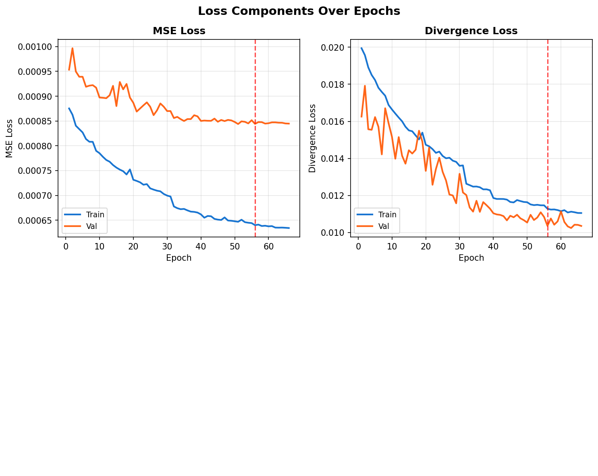
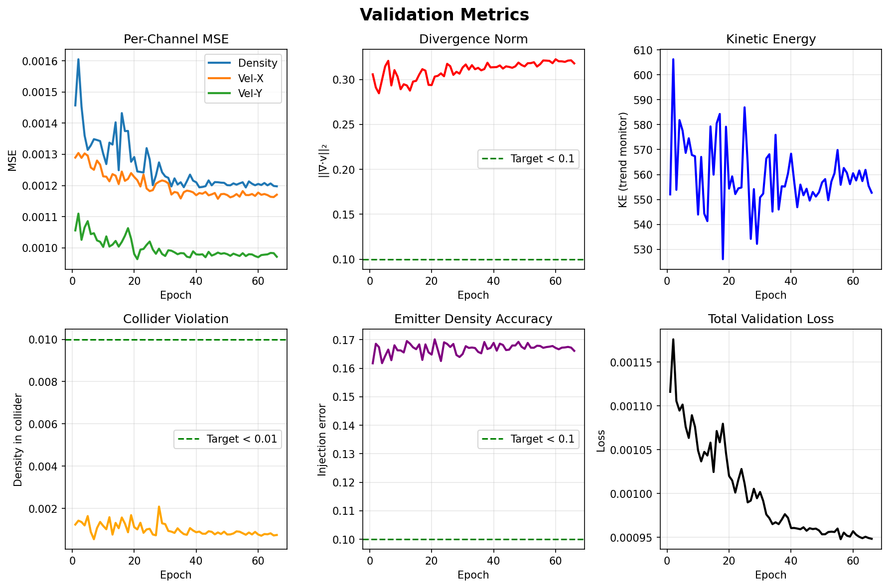
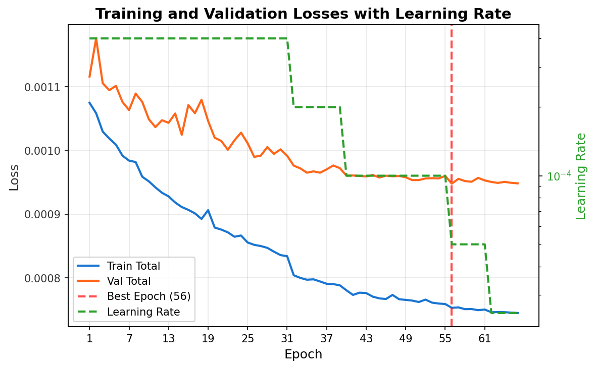

# ML Training Pipeline

This is where the neural network learns to be a fluid simulator. I train a UNet on sequences from Blender/Mantaflow simulations, then export it to ONNX so the C++ engine can run it in real-time.

## Training Data

The training data comes from the [vdb-tools](../vdb-tools/README.md) pipeline - 3D Blender simulations projected onto 2D and saved as NPZ files. Each sequence contains a few hundred frames of fluid behavior: smoke rising, obstacles blocking flow, emitters spawning density.

I tried to create diverse training scenarios:
- Simple setups (single emitter, empty space)
- Complex shapes (multiple emitters, obstacles everywhere)
- Empty scenes (no emitter active, just obstacles and initial velocity)
- Roughly 50/50 split on colliders vs no colliders

The idea was to teach the network a variety of scenarios so it generalizes. Though honestly, with more experience, the data generation could probably use some improvements.

## The Model

A UNet - encoder-decoder architecture with skip connections. Nothing fancy, just a solid convolutional network.

**Input:** Current state (density + velocity) + previous frame density + emitter/collider masks (6 channels total)

**Output:** Next frame (density + velocity, 3 channels)

I experimented a lot with the architecture:
- Different depths (how many downsampling/upsampling stages)
- Base channel counts (how wide the network is)
- Normalization layers (batch norm, instance norm, group norm, or none)
- Activation functions (ReLU, LeakyReLU, GELU, SiLU)
- Upsampling methods (bilinear interpolation vs learned transpose convolutions)

Multiple model sizes were tested (small, medium) trying to balance quality vs inference speed. Smaller models run faster but struggle with complex physics like collider interactions.

## Multistep K Training - The Breakthrough

This is the game-changer that made everything work more realistically.

**The Problem:** When you train a model to predict just one frame at a time (single-step, K=1), it works fine during training. But when you run it autoregressively - feeding its own predictions back as input for hundreds of frames - it drifts. Errors accumulate and the simulation becomes unstable.

**The Solution:** Multistep training (K=2, K=3, K=4).

Instead of training the model to predict frame `t+1` from frame `t`, I train it to predict K frames into the future *during training*. The model outputs frame `t+1`, then that prediction becomes the input for predicting `t+2`, and so on for K steps.

This forces the network to learn dynamics that are stable over longer horizons. It has to deal with its own errors during training, so it learns to not make them in the first place.

**Why it matters:**
- Without K training: models drift after a few dozen frames
- With K training: stable rollouts for hundreds of frames
- This is what enables the real-time engine to run autoregressively without exploding

I started with K=1, then moved to K=2, then K=3, eventually K=4. The higher K, the more stable the long-term rollouts. Training takes longer (you're computing more forward passes per batch), but the improvement in rollout quality is massive.

**Weight decay experiments:** I also experimented with rollout weight decay - how much to weight each step in the K-step loss. Tried 1.0 (equal weighting), 0.80, 1.10, 1.50:
- Values < 1.0 smoothed the simulation
- Too high made it unstable
- Slightly > 1.0 (like 1.10) gave more emphasis on later frames - this worked best for me

**Gradient truncation:** I kept gradients flowing through the rollout (no detach between steps) which helped fluid quality, though it uses more memory. The current implementation isn't optimal, but it's flexible enough to experiment further - in theory could try K=10 or K=20, though not sure my GPU could handle it.

The training system allows configuring parameters independently for each K value, making it easy to experiment with different configurations (loss weights, learning rate, etc.) without starting from scratch.

Single-step training is the naive approach. Multistep autoregressive training is what makes a neural fluid simulator actually work in practice.

## Loss Functions & Experiments

I started out with a bunch of physics-aware losses:
- **MSE** (mean squared error) - the baseline reconstruction loss
- **Divergence penalty** - encourages velocity fields to be incompressible
- **Emitter loss** - prevents the model from hallucinating density in empty regions
- **Gradient loss** - helps preserve sharp smoke boundaries

Initially these felt important. But once I switched to multistep K training, most of them became less critical. The K rollout itself naturally forces better physical behavior - if the model violates physics, the rollout explodes during training and the loss goes up.

I'm still using divergence penalty, but honestly unsure if it's actually helping. Mostly experimentation at this point to figure out what matters.

<p align="center">
  
</p>
<p align="center"><em>MSE and divergence loss over epochs</em></p>

## Validation

Physics metrics are tracked during training:
- Per-channel MSE (density, velocity)
- Divergence norm (how incompressible the flow is)
- Kinetic energy (to detect instability)
- Collider violation (density inside solid obstacles)

<p align="center">
  
</p>
<p align="center"><em>Validation metrics tracked during training</em></p>

But those metrics don't tell the whole story. A model can have low divergence and still produce unconvincing fluid motion. It was important for me to validate in real conditions: export the model to ONNX, load it in the [C++ engine](../engine/README.md), and interact with it. Does the fluid swirl naturally? Do colliders work? Can you inject forces without the simulation breaking?

That qualitative evaluation is where you actually learn what the model can and can't do.

<p align="center">
  
</p>
<p align="center"><em>Training and validation losses with learning rate schedule (example run, not necessarily the demo model)</em></p>

## The Workflow

**1. Train**
```bash
cd ml
python scripts/train.py variants K3-Unet_medium-baseline
```

Training runs for a couple hundred epochs. MLflow tracks metrics. Checkpoints save automatically. Early stopping kicks in if validation loss plateaus.

**2. Export to ONNX**
```bash
python scripts/export_to_onnx.py
```

This converts the PyTorch model to ONNX format. The engine needs ONNX for inference.

**3. Test in Engine**

Load the exported model in the [C++ engine](../engine/README.md) and see how it performs in real-time. Try different scenarios. Push it until it breaks.

**4. Iterate**

Based on how the engine rollout looks, adjust training (more K steps? different loss weights? better data?) and repeat.

## Getting Started

**Train a model:**
```bash
cd ml
python scripts/train.py variants K3-Unet_medium-baseline
```

Check `config/variants/` for different experiment configurations. Variants use hierarchical inheritance so you can quickly try modifications (different K values, loss weights, architecture tweaks) without duplicating config.

**Monitor training:**
```bash
mlflow ui
```

Then navigate to `http://localhost:5000` to see training curves and metrics.

**Export for deployment:**
```bash
python scripts/export_to_onnx.py
```

The ONNX model goes to `data/onnx/` where the engine can load it.

## What's Next

The multistep K training approach works well, but there's still room for improvement:
- Better training data diversity (more complex scenarios, better coverage of edge cases)
- Understanding which losses actually matter (divergence penalty: useful or placebo?)
- Faster models that maintain physics quality (small UNets still struggle with colliders)
- Trying different architectures: transformers, implicit neural representations

This pipeline produces models that run in real-time and simulate believable fluid dynamics.
